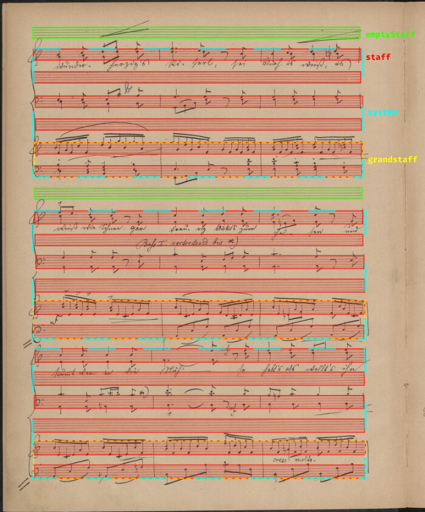
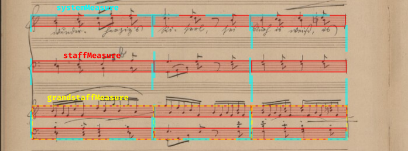

# MusiCorpus Specification 1.0

MusiCorpus is a set of guidelines on how to structure an Optical Music Recognition (OMR) dataset. The goal is to introduce a standard as to how OMR datasets are published, to decouple OMR data consumers from the specifics of how the dataset they use is structured. This will allow for easy replacement of datasets in experiments as well as their combination into larger corpora. Ideas here described build on the work by Shatri _et al._ in an attempt to make new datasets easier to compose together.


## Quick Intro

The directory structure for your data should look like something like this:

> **Note:** Emojis are not part of file names, they just communicate the meaning of files. Directories terminate with a forward slash. To see which files are mandatory and which optional and how, read the rest of the documentation.

```
root/ 🫜                            (root folder for everything)
│
├── CVC.Dolores/ 📚                 (dataset - a list of pages)
│   ├── musicorpus.json 🏛️          (metadata about the dataset)
│   ├── README.md                   (dataset description)
│   ├── LICENSE.txt ⚖️              (license for the data)
│   ├── splits.json 🪓              (train/val/test splits)
│   │
│   ├── CEDOC_CMM_1.5.1_0081.001/ 📜    (page name)
│   │   ├── image.jpg 🖼️
│   │   ├── metadata.json 🏛️
│   │   ├── subdivisions.image.json ✂️
│   │   ├── subdivisions.coco-object-detection.json ✂️
│   │   ├── layout.json 📏
│   │   ├── coco-object-detection.json 🥥
│   │   ├── transcription.musicxml 📄
│   │   ├── transcription.krn 🌰
│   │   ├── transcription.mei 🎶
│   │   ├── transcription.ly 🌱
│   │   ├── transcription.midi 🎹
│   │   ├── transcription.mung 🩻
│   │   │
│   │   ├── Systems/ 🎼
│   │   │   ├── 1/
│   │   │   │   ├── image.jpg 🖼️
│   │   │   │   ├── transcription.musicxml 📄
│   │   │   │   └── ...
│   │   │   ├── 2/
│   │   │   └── 3/
│   │   │
|   │   ├── Staves/ 🎼
|   │   |   ├── 1/
|   │   |   ├── 2/
|   │   |   └── ...
|   │   |
|   │   └── Grandstaves/ 🎼
|   |
|   |   (📜 more pages)
|   ├── UAB_LICEU_222570.112/
|   ├── CEDOC_CMM_1.5.1_0081.002/
|   └── XAC_ACUR_TagFAu127_007/
│
├── UFAL.OmniOMR/ 📚                (another dataset)
│   ├── ...                         (its top-level files)
│   │
│   │   (📜 pages)
│   ├── 1d507bc2-87e7-4b61-8bea-6126616c4851_16e3cbb5-bd89-48c2-80a6-cccbcaeb7893/
│   ├── 6aa42890-26ea-11ee-be80-0050568d319f_c0cef25c-e9f9-4d49-8dd8-ae38fe6f4744/
│   ├── 11ccf60d-cc2e-4843-806c-f647e910fa13_24fd65a4-6a07-4d25-a986-f95d083e6142/
│   └── ...
│
└── YourInstitution.YourDataset/ 📚
    └── ...
```


## Root Directory 🫜

The tree directory structure above starts with a `root/` folder. This can be any folder of your choosing that houses your MusiCorpus datasets for your project. It can be global folder for all projects, say `/home/john-doe/datasets` or it can be scoped within the repository of your project, say `/home/john-doe/projects/my-project/datasets`. The choice is up to the user.

The root folder can also contain any other datasets that do not follow the MusiCorpus structure. You can distinguish a MusiCorpus dataset from other datasets by the fact, that a MusiCorpus dataset must have a `musicorpus.json` file in its root.


## Dataset Folder 📚

MusiCorpus aids dataset harmonization between researchers by providing guidelines on a shared folder structure and its semantics. However each dataset creator is still responsible for publishing their own dataset, keeping it up to date and following the guidelines. That's why each MusiCorpus-compatible dataset is released as a separate, independent folder. These folders are then placed into the root directory for ease of consumption by the user.

The dataset folder's name must provide the name of the organization that packaged the dataset and the name of the dataset following this pattern:

`[Organisation Name].[Dataset Name]`

Both the organisation name and dataset name must only include alphanumeric characters with CapCase spelling. We recommend using abbreviated forms for both. For example, the Computer Vision Center-built DoLoReS dataset can be found under the `CVC.Dolores` folder.


### Folder Name Limitations

The dataset folder name, as well as all of its sub-folder names, should be an arbitrary ASCII string, excluding:

- Control Characters (range 0-31)
- `<` and `>` (Opening and closing chevrons)
- `:` Colon
- `"` Double quote
- `/` Forward slash
- `\` Back slash
- `|` Pipe
- `?` Question mark
- `*` Asterisk
- ` ` Spaces

While limiting, we want to ensure that most folders are easily accessible by most mainstream operating systems, including Linux and Windows and also minimise annoying mistakes such as trailing or leading whitespace, multiple spaces and underscores.


### Dataset Folder Structure

A dataset is conceptualized as a set of pages, where each page image comes with machine-readable annotations. This page-primacy comes from the way music notation is physically realised. Libraries hold books with pages of music notation and notation software (e.g. MuseScore) produces PDFs with pages of music notation.

Files in the dataset folder contain dataset-level metadata and folders represent individual pages of music notation (see [Page Folders](#page-folders-)).

Despite the folder structure being page-organized you are not required to provide page-level data in your dataset to comply with MusiCorpus. Each page may contain so-called *subdivisions*, such as systems, staves and grandstaves. Their structure is equivalent to page-folders, but they focus on smaller subdivisions of music notation. Subdivisions can be provided in addition to page-level data (as crop-outs from pages) or completely stand alone with the page-level data missing.

**Example 1:** The OmniOMR dataset primarily contains pages of music notation annotated in MusicXML and MuNG and then contains subdivisions to systems on the page, where each system contains a cropped version of the page image, cropped version of the MuNG annotaion and a sliced out version of the MusicXML annotation. Here, the system-level subdivision is a different view of the same page-level data.

**Example 2:** The DoLoReS dataset is annotated as system-level images and system-level MusicXML transcriptions. The page-level annotations are then created ex post by concatenating the system-level MusicXML files.

**Example 3:** The [OLiMPiC scanned dataset](https://github.com/ufal/olimpic-icdar24/releases/tag/datasets) only contains grandstaff-level MusicXML annotations and grandstaff image crops. These come from pages, but the original page scans are not present in the dataset. It can be reshaped into the MusiCorpus structure in this way:

```
UFAL.OlimpicScanned/ 📚
├── musicorpus.json 🏛️
├── ...
│
├── 5026306-p5/ 📜
│   └── Grandstaves/ 🎼
│       ├── 1/
│       │   ├── image.jpg 🖼️
│       │   └── transcription.musicxml 📄
│       └── 2/
│           ├── image.jpg 🖼️
│           └── transcription.musicxml 📄
├── 5026306-p6/ 📜
├── ...
├── 6377942-p1/ 📜
└── 6377942-p2/ 📜
```

Notice that OLiMPiC is organized into "scores" (e.g. `5026306`) and that score has samples `p5-s1.png` (page 5, grandstaff 1). In MusiCorpus these are re-grouped into page names `5026306-p5` (score 5026306, page 5) and that page has NO page-level information, only grandstaff-level image and MusicXML transcription.


## `musicorpus.json` 🏛️

*(this is a **mandatory file**, each MusiCorpus dataset must have it)*

A `musicorpus.json` must sit in the root of every MusiCorpus-compatible dataset. It provides metadata about the whole dataset.

This is an example `musicorpus.json` file for the `CVC.Dolores` dataset:

```json
{
    "musicorpus_version": "1.0",
    "full_institution_name": "Computer Vision Center, Universitat Autònoma de Barcelona",
    "short_institution_name": "CVC",
    "institution_url": "https://www.cvc.uab.es/",
    "full_dataset_name": "DoLoReS",
    "short_dataset_name": "Dolores",
    "dataset_url": "https://pages.cvc.uab.es/musicscores/loladocs/index.html",
    "dataset_version": "1.0",
    "created_at": "2026-03-05T10:16:37Z",
    "author_emails": [
        "ptorras@cvc.uab.cat",
        "afornes@cvc.uab.es"
    ]
}
```

**`musicorpus_version`**: Version of the MusiCorpus dataset format used, as well as the version of the `musicorpus.json` file format.

**`full_institution_name`**: Human-readable name of the institution behind the dataset. If only an individual person, then the full name of the individual.

**`short_institution_name`**: The first-half of the dataset folder name (i.e. `*CVC*.Dolores`), must match exactly and be a path-safe string (see folder name limitations above for more).

**`institution_url`**: URL link to the website of the institution. If an individual person, link to their website or may be left empty.

**`full_dataset_name`**: Human-readable name of the dataset.

**`short_dataset_name`**: The second-half of the dataset folder name (i.e. `CVC.*Dolores*`), must match exactly and be a path-safe string (see folder name limitations above for more).

**`dataset_url`**: URL link to the website about the dataset or the project from which the dataset arose. May be left empty.

**`dataset_version`**: Version of the dataset in the `{major}.{minor}` format. Increment `minor` whenever you fix bugs in the dataset or add additional transcriptions or subdivisions (systems, staves, grandstaves) of existing data. Increment `major` when you change dataset splits, add/remove data samples or change versions or semantics of existing transcriptions. During development, you can use `0.x` versions and increment `minor` with any changes as you see fit.

**`created_at`**: [ISO 8601](https://en.wikipedia.org/wiki/ISO_8601) timestamp of the moment the dataset was put together (exported by a script or considered "done" by a human).

**`author_emails`**:  List of email addresses of authors, sorted by who should be emailed first/second/etc.


## `README.md`

*(this is a **mandatory file**, each MusiCorpus dataset must have it)*

The `README.md` file is the first entrypoint for the user of a MusiCorpus dataset. It should contain all the non-structured information about your dataset a user may wish to know. You can take the template below, answer all the questions and add any additional information specific to your dataset:

```md
# John's Dataset

Q: What task is the dataset intended for?
A: John's Dataset is an OMR dataset intended for object-detection/end-to-end model training/semantic segmentation/music notation layout analysis/music information retrieval/OMR evaluation benchmark/etc...

Q: How much data is included in the dataset? Number of pages, staves, etc.


## Data preparation

Q: What is the source data.
Q: What data was manually annotated.
Q: What data was derived computationally.
A: Physical books come from the XYZ library from the 18th and 19th century. Scans were captured by the XYZ library and are the base data this dataset builds upon. We ran an annotation process to create all the `transcription.musicxml` files. The annotation process is described in paper XYZ. The `transcription.krn` files were created via an automatic conversion script from MusicXML any may contain conversion errors in these edgecases which could be improved upon by a better conversion pipeline.


## Data structure

Q: Is there a structure behind page names?
Q: Are pages primary and systems/staves/grandstaves derived or is it the over way around?
Q: What version of MuseScore was used to annotate the MusicXML, what semantics was used etc...
Q: Does the dataset use some annotation format in some non-obvious way? (e.g. MuNG only for bboxes, but not for masks)
Q: Which files are present in ALL pages/systems/staves and which only in some?


## Various

Q: Are the source images accessible via the internet? At what URLs?
Q: Do you deviate from the MusiCorpus guidelines? Where and how?


## Licensing

Q: What is the license?
A: The dataset is provided under CC0 and CC BY-SA 4.0 licenses.

Q: What files are under what license?
A: All the images (`image.jpg` files) are provided under the CC0 license (see `LICENSE.images.txt`) and their transcriptions (`transcription.musicxml`) are provided under CC BY-SA 4.0 license (see `LICENSE.txt`).

```


## `LICENSE.txt` ⚖️

*(this is a **mandatory file**, each MusiCorpus dataset must have it)*

This file contains the legal code of the license, under which the dataset is published. This would be an example body for [CC BY-SA 4.0 license](https://creativecommons.org/licenses/by-sa/4.0/):

```
Attribution-ShareAlike 4.0 International

=======================================================================

Creative Commons Corporation ("Creative Commons") is not a law firm and
does not provide legal services or legal advice. Distribution of
Creative Commons public licenses does not create a lawyer-client or
other relationship. Creative Commons makes its licenses and related
...
```

If there are multiple licenses used (for example, the images have different license than the transcriptions or a set of pages has a different license etc.), provide multiple license files with this naming:

```
LICENSE.txt                 (the default license)
LICENSE.images.txt          (license for images)
LICENSE.transcriptions.txt  (license for transcriptions)
LICENSE.my-split.txt        (license for pages in "my-split")
```

When multiple licenses are provided, it must be specified in the `README.md` file which licenses apply to which files in the dataset.


## `splits.json` 🪓

*(this is a **mandatory file**, each MusiCorpus dataset must have it)*

Each dataset consists of a list of pages, and these pages are cut into splits designed for model training, validation and testing. The `splits.json` file defines which pages belong to which split.

Make sure your `README.md` contains information on how these splits were generated (if there are any independence guarantees, such as handwriting author, or if it is just a random shuffle).

This is the internal structure of a `splits.json` file:

```json
{
    "train": [
        "CEDOC_CMM_1.5.1_0081.001",
        "CEDOC_CMM_1.5.1_0081.002",
        ...
    ],
    "validation": [
        "XAC_ACUR_TagFAu127_007",
        ...
    ],
    "test": [
        "UAB_LICEU_222570.112",
        ...
    ],
}
```

The three splits in `splits.json` must NOT share any pages - they must be disjoint sets. They are NOT required to cover the complete set of pages (say if you want to make the splits compatible with alternative splits), but it is recommended. Also, the `validation` set is optional, but recommended.

If you want to provide multiple different splits (e.g. to ensure different independencies or use-cases), you can do so by naming these alternative splits in this way:

```
splits.writer-independent.json
splits.domain-adaptation.json
splits.{your-splits-name}.json
```

Make sure to also document their purpose in the `README.md` file.

In these alternative splits, you can add additional sets of pages, say `"holdout"` or `"finetuning"` if it makes sense. But the primary `splits.json` file should be left in its default, simple structure of train-validation-test. You can create an alternative split, such as `splits.with-holdout.json` for your additional page sets.


## Page Folders 📜

As mentioned, each folder within a dataset corresponds to all of the data associated with a page. The naming scheme for page folders is up to the dataset creator to decide and must follow the [folder name limitations](#folder-name-limitations) described above. The page name structure should be described in the `README.md`, if there is any.

Each page folder contains files that hold data for that page, such as:

- an image (scan) of the page (JPEG)
- page-level metadata (page source information, notation complexity)
- object detection annotations (COCO)
- transcriptions to MusicXML, kern, MEI, abc


### Page Subdivisions 🎼

Until recently, there were no page-level end-to-end deep learning models. Only one-staff and then one-grandstaff models were available. Because the research on one-staff models is still not done and because training page-level models is complicated, MusiCorpus provides subdivisions - a narrowed view at a page at the staff level. These subdivisions are stored in a page folder in the following fashion.

Each page folder optionally contains some of these three folders:

- `Staves` (for solo-staff models)
    - `1/`, `2/`, `3/`, ...
- `Grandstaves` (for piano grandstaff models)
    - `1-2/`, `3-4/`, ...
- `Systems` (for system-level models)
    - `2-7/`, `9-14/`, `15-20/`, ...

Each may contain a list of zoomed-in views of the page, to all of its systems, staves or grandstaves. Each subdivision folder then may contain the same image and transcription files as the page folder, just zoomed in and cropped respectively. Names of systems, staves and grandstaves can be any path-safe strings, however, MusiCorpus recommends using the following policy when possible.

Take this page as an example ([see the page](http://digitalniknihovna.cz/mzk/uuid/uuid:d1769738-290b-4810-90b7-19fd8708d0c7)):


There are 20 staves on the page, we number them `1` to `20` (1-based index).

For the `Staves` subdivision, we could take all 20 staves and use them as is, but the staves `1,3,5,8,10,12,18` are empty and contain no music. If we have the information available, we can discard these and only create subdivision folders for the remaining staves:

```
8136b106-6283-42c6-99eb-2f46c519c931_d1769738-290b-4810-90b7-19fd8708d0c7/ 📜
└── Staves/ 🎼
    ├── 2/
    │   ├── image.jpg 🖼️
    │   └── transcription.musicxml 📄
    └── 4/, 6/, 7/, 9/, 11/, 13/, 14/, 15/, 16/, 17/
```

The `Staves/2/image.jpg` file will look like this:


The `Staves` subdivision is meant for training solo-staff models. The notation complexity may be arbitrarily complex (monophonic or polyphonic), but it should be contained on a single staff.

The `Grandstaves` subdivision is an analogous subdivision meant for single-grandstaff (piano) end-to-end models. It should always contain 2 staves, where the notation on them resembles piano music (either the staves are grouped by a brace, or they belong together based on the G-clef, F-clef combo).

Grandstaff folders should be composed from the staff numbers defined above:

```
8136b106-6283-42c6-99eb-2f46c519c931_d1769738-290b-4810-90b7-19fd8708d0c7/ 📜
└── Grandstaves/ 🎼
    ├── 6-7/
    │   ├── image.jpg 🖼️
    │   └── transcription.musicxml 📄
    ├── 13-14/
    └── 19-20/
```

> **Note:** If you have a dataset, where you can't resolve the staff numbers, you can just number the grandstaves from `1` and increasing (`1/`, `2/`, `3/`).

The `Grandstaves/6-7/image.jpg` will look like this:


Note that a single staff may be present in both the `Staves` subdivision and the `Grandstaves` subdivision as a part of a grandstaff. This is, however, only possible for grandstaves that contain staff-separable music. In complex pianoform music, where beams and voices cross staves of the grandstaff, that grandstaff may only be present in `Grandstaves` but cannot be present in `Staves`, because the music notation on one staff does not remain only on that staff.

This is an example of a grandstaff, that cannot be separated out into individual staves ([see page](https://digitalniknihovna.cz/mzk/uuid/uuid:308137da-5365-4b05-8d46-2908974b1089)):


Finally the `Systems` subdivision is again analogous to `Grandstaves`, except it captures individual systems (staves of all instruments that play together).

The system folders should again be composed of staff numbers from above:

```
8136b106-6283-42c6-99eb-2f46c519c931_d1769738-290b-4810-90b7-19fd8708d0c7/ 📜
└── Systems/ 🎼
    ├── 2-7/
    │   ├── image.jpg 🖼️
    │   └── transcription.musicxml 📄
    ├── 9-14/
    └── 15-20/
```

> **Note:** If you have a dataset, where you can't resolve the staff numbers, you can just number the systems from `1` and increasing (`1/`, `2/`, `3/`).

The `Systems/2-7/image.jpg` will look like this:


## `image.jpg` 🖼️

*(this file is **optional**, but it should be present at least at some subdivision levels, since MusiCorpus aims at OMR use cases)*

In each page, staff, grandstaff or system, there may be the `image.jpg` file which contains the image being recognized and transcribed.

If an image is to be made available, it must be provided in the `.jpg` suffix. The `.jpeg` suffix is not recommended. In addition, you may provide `.png` or `.tif` images if your image is born-digital and you want to preserve its quality.

If you want to provide multiple alternative images for the same sample, you can do so with this naming convention:

```
image.distorted.jpg
image.synthetic.jpg
image.binarized.jpg
image.{variant}.jpg
```

An example would be the GrandStaff dataset, which provides synthetic plain images and synthetic distorted images for the sample `.krn` samples. Note that these alternative variants interfere with the semantics of the `subdivisions.image.json` file (see below). Use image variants either when you don't support this subdivisions mapping, or make sure that the mapping matches the default `image.jpg` variant and then optionally provide alternative mappings, such as `subdivisions.image.{variant}.json` when it makes sense.


### `subdivisions.image.json` ✂️

*(this file is **recommended** if you have multiple simultaneous subdivisions with images present)*

If you have the page-level `image.jpg` files and also staff/grandstaff/system level `image.jpg` files, these smaller images are just simple rectangular crops of the larger page-level image. The `subdivisions.image.json` file can be placed in the page folder to specify the exact coordinates, where the subdivision images were cropped from the page-level image.

This is the structure of the file:

```json
{
    "Staves": {
        "1": {
            //      left  top  width height   (COCO-style)
            "bbox": [151, 112, 2601, 240]
        },
        ...
    },
    "Grandstaves": {
        "6-7": {
            "bbox": [162, 908, 2572, 456]
        },
        ...
    },
    "Systems": {}
}
```

For each subdivision image there is a JSON object at a corresponding "path". For `Grandstaves/6-7/image.jpg`, the JSON object is at `"Grandstaves"."6-7"`. The JSON object has just a single field, and that is `bbox`:

```json
{
    "bbox": [162, 908, 2572, 456]
}
```

The `bbox` field is a COCO-style rectangle `[left, top, width, height]` where `left` and `top` is 0-based pixel index of the top-left pixel of the rectangle and `width` and `height` are the dimensions of the rectangle in pixels. This should exactly match the size of the subdivision `image.jpg` file.

All pixel coordinates are the parent page-level `image.jpg` pixel coordinates (i.e. they can be used directly as-is to crop out the small subdivision image).

These coordinates locate the subdivided image in the page-level image, they do NOT locate the bounding box of a staff, grandstaff or system. For precise locations of layout-features see the `layout.json` 📏 file.

Because object-detection and semantic-segmentation (COCO) annotations depend directly on the small subdivision image, these mapping bboxes can also be used to translate between subdivision COCO anotations and page-level COCO annotations (position-wise).

If you provide images in multiple variants (the `image.{variant}.jpg` files), then you can optionally provide subdivision mapping for these variants as well via this naming scheme:

```
subdivisions.image.distorted.json
subdivisions.image.synthetic.json
subdivisions.image.binarized.json
subdivisions.image.{variant}.json
```


## `metadata.json` 🏛️

*(this file is **optional**, it is not required in a MusiCorpus dataset)*

Each page in the dataset should contain a metadata file which describes the source document itself (the image / piece of paper), the musical work in that page (composer, date) and music notation information, such as its complexity (monophonic vs. polyphonic, etc.), type of notation (CMWN, mensural, etc.), production (handwritten/printed/born-digital), clarity/readability, etc.

The metadata is stored as a list of fields of a JSON file. If a value is unknown for the given page, `null` should be used. If a field does not make sense for the given page, `false` should be used (e.g. author name for synthetically generated music). If a field is missing all togeter, it is assumed to have the value of `null`.

This is an example record:

```json
{
    "file_name": "CVC.Dolores/CEDOC_CMM_1.5.1_0081.001/image.jpg",

    // source document metadata
    "institution_name": "Moravian State Library",
    "institution_rism_siglum": "CZ-Bu",
    "institution_local_siglum": "MZK",
    "shelfmark": null,
    "rism_id_number": "sources/1001086460",
    "date": "1804",
    "page_number": 14,
    "page_size": [235, 285],
    "dpi": 275,
    "scribal_data": null,
    "link": "https://www.e-rara.ch/mab/content/zoom/28920816",

    // musical work metadata
    "title_description": "Sonata I [G-Dur op. 40 Nr. 1]",
    "author": "Muzio Clementi",
    "author_date": "1752-1832",
    "genre_form": "piano sonata",
    
    // music notation and OMR metadata
    "notation": "CWMN",
    "notation_detailed": null,
    "production": "printed",
    "production_detailed": "19th century engraving, highly standardised",
    "notation_complexity": "pianoform",
    "clarity": "perfect",
    "systems": "grand_staffs"
}
```

This is the meaning of individual fields:

- **`file_name`**: Path to the image (relative to the `root/` folder) this metadata file describes.

Then come fields related to the source:

- **`institution_name`**: Human-readable name of the holding institution (library). Should be `false` for images that are born-digital and are not held by any institution.
- **`institution_rism_siglum`**: [RISM](https://rism.info/community/sigla.html) assigns abbreviations to institutions holding musical works. This field should contain the siglum of the `institution_name` above. Should be `null` if the institution does not have a siglum yet. Should be `false` if the source document is not held in an institution.
- **`institution_local_siglum`**: The abbreviation by which the institution refers to itself. Should be `false` if the source document is not held in an institution.
- **`shelfmark`**: Identifies the source (manuscript, print, ...) within the institution's collection. Same as RISM shelfmark. Should be `null` if unknown. Should be `false` if the source document is not held in an institution.
- **`rism_id_number`**: If the source is catalogued in RISM, then this should be given. This field acts as a fallback if `shelfmark` does not exist. Should be `false` if not catalogued or `null` if unknown.
- **`date`**: The year when was the source created. This can be very different from when the music therein was composed (e.g. 20th century editions of Renaissance music). A specific year is usually very hard to pinpoint so instead this field is a string which allows for best-effort description of the year range if a singular year cannot be pinned down. Should be `null` if unknown.
- **`page_number`**: Some identification of the image within the source. Can be just a number, or foliation (e.g. f55v). Intended to be human-readable. Should be `null` if unknown.
- **`page_size`**: Size of the physical page/book in millimeters, `[width, height]`. It may be used to estimate DPI if DPI is not explicitly provided (with estimation error given by the margin around the page in the page scan image). Should be `null` if unknown. Also, individual dimensions may be `null` if only one dimension is known.
- **`dpi`**: Actual DPI at which the image was scanned. Ideally as precise as possible - estimated via color calibration tables or rulers. Should be `null` if unknown.
- **`scribal_data`**: Identifier of a handwriting/typesetting style (string or integer). May be used by a dataset intended for writer identification. Should be `null` if unknown or if not provided. Identifiers should be unique within the dataset.
- **`link`**: URL to page image, if available. Prefer URL from holding institution, if not available, then other digitised version in RISM. Should be `null` if unknown or if such a link does not exist.
- **`title_description`**: Name of the composition (the musical piece captured within the document), e.g. "Sonata XYZ". Stick to RISM as much as possible. Should be `null` if unknown. Should be `false` if not aplicable (e.g. synthetic music).
- **`author`**: Name of the composer, should be `null` if unknown. Should be `false` if not aplicable (e.g. synthetic music). Stick to RISM naming.
- **`author_date`**: Lifespan of the author, range of integers, e.g. `1752-1832`. Use `?` if one of the dates is uncertain, e.g. `?-1832`. Should be `null` if fully unknown. Should be `false` if not aplicable (e.g. synthetic music). Stick to RISM dating system.
- **`genre_form`**: Human-readable, uncontrolled characterisation of the work, e.g. `piano sonata`, `sting quartet`, `motet`. Should be `null` if not provided.

Finally, and most importantly for OMR, there are fields that characterise the notation on the page. Controlled vocabularies build on the taxonomy presented in the "Understanding OMR" paper.

- **`notation`**: Type of music notation. Must be one of: `CWMN`, `mensural`, `square`, `adiastematic`, `instrument-specific`, `other`. Should be `null` if unknown or not specified.
- **`notation_detailed`**: Optional more fine-grained description, e.g. `Black menusral`, `Suzipu`, `Franconian`, `German 16th c. lute tablature`, `Jeonggangbo`, `lead sheet`, `mountain hymnals`, etc. Should be `null` if not specified.
- **`notation_complexity`**: One of the four leves defined in the "Understanding OMR" paper. Must be one of: `monophonic`, `homophonic`, `polyphonic`, `pianoform`. Mark the page according to the most complex level that it contains -- for instance, the score of a piano concerto with just one grand staff with pianoform notation and everything else monophonic will be marked `pianoform`. The point is to signal "in order to recognise this page completely, one must account for this level of notation complexity". Should be `null` if not specified.
- **`production`**: How was the music document created. Must be one of: `printed`, `handwritten`, `born-digital`. Should be `null` if not specified. Printed includes old printed scores as well as modern ink-jet printed and then scanned scores. Born-digital means being rendered by Verovio, Lilypond, MuseScore and other similar software directly to a JPEG/PNG file.
- **`production_detailed`**: Optional more fine-grained description, e.g.: `MuseScore`, `LilyPond with font...`, `movable type`, `sharpie marker`, `quill`, etc. Should be `null` if not specified.
- **`clarity`**: The combined visual quality/readability of the page. There are four categories: `perfect`, `sufficient`, `problematic`, and `unreadable`. More discussion on this category, including criteria, below. Should be `null` if not specified.
- **`systems`**: Basic information about the relationship between staffs, systems, and reading order. Again, it serves as a signpost: "What do I have to care about when I use this dataset?" The field value is the answer to the question: "What does a single system of music consists of in this document?" Must be one of: `single-staff`, `grand-staff`, `multi-instrument`, `variable`. Should be `null` if not specified. If all systems on a page are of one type (`single-staff`, `grand-staff`, `multi-instument`), then that type is the value of this field. If there is at least one system of different type (e.g. when there are multiple songs within one page with different setup), then `variable` should be used.


### The `clarity` field

This categorisation provides a rough idea of the kinds of issues connected to image quality, document damage, readability, and other difficulties connected to visual aspects of the notation one might encounter on the page. It is not intended to be an exhaustive scale, just a rough indication. The point of this taxonomy is also to give insight into how robust systems are to this kind of difficulties when evaluating them (accuracy on category 1 pages, category 2, etc.). Its definition is inspired by the [Nutri-Score scale](https://en.wikipedia.org/wiki/Nutri-Score) and there is [research](https://hal.science/hal-01879782/file/DAS2018.pdf) that indicates correlation between readability and perception of quality which underpins this scale.

1. **`perfect`**: Born-digital, scan/photo with good even lighting, no bleedthrough or stains or scribbles or deformation.
2. **`sufficient`**: Does not fulfill conditions of category 1, but is still sight-readable by an experienced musician without them complaining too much. (Manuscripts: imagine HIP people.)
3. **`problematic`**: Bad handwriting, damage that interferes with ability to sight-read, requires time. Impractical --- a musician might refuse to play from this music. But with sufficient effort the music could be transcribed unambiguously from it, just some isolated elements may be ambiguous or unreadable.
4. **`unreadable`**: The music is difficult to read to the point of ambiguity ("Which line is this notehead on? Is this a staccato dot, or insect? What notes does this beam belong to?"), page is heavily damaged, imaging quality is terrible (blur or bad/uneven lighting to the point of damaging readability), etc., and these issues are pervasive (affect more than 5-10% of the music on the page surface).

This is just a way to explain what the categories should approximately mean. "What issues you have to care about when you're doing OMR system design over this dataset."

The point of this is also to have training data for identifying problematic pages in collections that will need manual attention.


## `coco-object-detection.json` 🥥

*(this file is **optional**, it is not required in a MusiCorpus dataset)*

Each *Page*, *System*, *Staff*, or *Grandstaff* MAY contain a `coco-object-detection.json` file that contains [MS COCO Object detection annotations](https://cocodataset.org/#format-data) for the corresponding `image.jpg` file (e.g. for COCO file in a *Staff* folder, the annotations correspond to the image in the same *Staff* folder).

This is a shortened example for the *Page* `CEDOC_CMM_1.5.1_0081.001` in the `CVC.Dolores` dataset:

```json
{
    "info": {
        "year": 2025,
        "version": "1.0",
        "description": "CVC.Dolores",
        "contributor": "Computer Vision Center, Universitat Autònoma de Barcelona",
        "url": "https://pages.cvc.uab.es/musicscores/loladocs/index.html",
        "date_created": "2025/11/28"
    },
    "licenses": [
        {
            "id": 0,
            "name": "CVC.Dolores/LICENSE.txt",
            "url": "musicorpus://CVC.Dolores/LICENSE.txt",
        }
    ],
    "images": [
        {
            "id": 0,
            "width": 3364,
            "height": 4010,
            "file_name": "CEDOC_CMM_1.5.1_0081.001/image.jpg",
            "license": 0,
            "date_captured": "2025-11-28 13:23:25"
        }
    ],
    "annotations": [
        {
            "id": 0,
            "image_id": 0,
            "category_id": 0,
            "segmentation": [[356, 428, 357, 428, ...]], // polygon
            "area": 546,
            "bbox": [641, 471, 21, 26],
            "iscrowd": 0
        },
        {
            "id": 1,
            "image_id": 0,
            "category_id": 4,
            "segmentation": { // RLE mask
                "size": [24, 20],
                "counts": [8, 2, 9, 1, 4, ...]
            },
            "area": 480,
            "bbox": [679, 445, 20, 24],
            "iscrowd": 0
        },
        ...
    ],
    "categories": [
        { "id": 0, "name": "noteheadBlack" },
        { "id": 1, "name": "accidentalFlat" },
        { "id": 2, "name": "barlineSingle"},
        { "id": 3, "name": "beam"},
        { "id": 4, "name": "fermataAbove"}
        ...
    ]
}
```

**`info`**: An object that contains dataset-level metadata. This value should be identical for all `coco-object-detection.json` files in the dataset.

- **`year`**: Must equal the year value of the `date_created` field below.
- **`version`**: Version of the dataset. Must equal the `musicorpus.json/dataset_version` field.
- **`description`**: Name of the musicorpus dataset. Must equal the dataset folder name as well as the `musicorpus.json` fields `short_institution_name` and `short_dataset_name`.
- **`contributor`**: Name of the institution or individual behind the dataset. Must equal the `musicorpus.json/full_institution_name` field.
- **`url`**: URL link to a website about the dataset or project. Must equal the `musicorpus.json/dataset_url` field.
- **`date_created`**: Date when the dataset was created. Must have format `YYYY/MM/DD` and be equal to the value of the `musicorpus.json/created_at` field.

**`licenses`**: List of licenses used in this COCO file.

- **`id`**: Integer ID of the license within this COCO file.
- **`name`**: Human-readable name of the license, such as `CC BY-SA 4.0`, however for simplicity, you can set this field to the MusiCorpus path to the license file, e.g. `CVC.Dolores/LICENSE.txt` or if a specific license is used then `CVC.Dolores/LICENSE.transcriptions.txt` etc.
- **`url`**: URL link to the license body. Because a MusiCorpus dataset contains the license file within itself, the link should look like this: `musicorpus://CVC.Dolores/LICENSE.txt`. The `musicorpus://` URI scheme is there to differentiate it from HTTP links. However HTTP links may also be used, if your license is hosted on a website and you prefer this option.

**`images`**: Contains the single image for which this `coco-object-detection.json` file holds annotations.

- **`id`**: Integer ID of the image within this COCO file.
- **`width`**: Width of the image in pixels.
- **`height`**: Height of the image in pixels.
- **`file_name`**: Posix path (forward slashes) from the root of the dataset (`CVC.Dolores`) to the image file.
- **`license`**: The license ID that applies to the image file.
- **`date_captured`**: Timestamp when the image file was first created. This can be the time it was scanned, or created (for born-digital images). If unavailable, it can be set to the creation time of the dataset (the `musicorpus.json/created_at` field). It must have the `YYYY-MM-DD hh:mm:ss` format and be in UTC time.

**`anotations`**: List of annotated object instances in the image.

- **`id`**: Integer ID of the object instance within this COCO file. If the same object is present in two overlapping images (say a page and its staff subdivision), the mapping between their COCO IDs is captured in the [`subdivisions.coco-object-detection.json`](#subdivisionscoco-object-detectionjson-️) file in the page folder.
- **`image_id`**: What image does this annotation belong to (see `images` above).
- **`category_id`**: What is the "label" (e.g. notehead black) for this object (see `categories` below).
- **`segmentation`**: Polygon or RLE-encoded pixel mask for the object. See [COCO segmentation encoding](#coco-segmentation-encoding) below for details.
- **`area`**: Number of pixels in the annotated area (not just bbox area, but actual mask area). See [COCO area computation](#coco-area-computation) below for details.
- **`bbox`**: Bounding box for the mask in the form `[x, y, width, height]` where all numbers are integers and x and y are zero-based coordinates.
- **`iscrowd`**: Determines, whether the annotation contains a single instance (`0`) or s crowd of instances (`1`). For music notation glyphs it makes sense to only annotate individual instances, so this field should always be set to `0`.

**`categories`**: Mapping between category ("label") IDs and names. The mapping contains only those categories that are actually used inside the `annotations` list above.

- **`id`**: Integer ID of the category within this COCO file. One category name must always have exactly one ID (no duplicate categories).
- **`name`**: String name of the category, e.g. `noteheadBlack`.
- **`supercategory`**: Not used in MusiCorpus, despite COCO allowing it.


### COCO `segmentation` encoding

> **Note:** Most of this information was reverse-engineered from [`pycocotools` source code](https://github.com/cocodataset/cocoapi/blob/master/PythonAPI/pycocotools/coco.py), because the [COCO format specification](https://cocodataset.org/#format-data) is just sooo underwhelming...

The `segmentation` can be represented as polygons, or as RLE-encoded pixel mask.

**Polygon representation** consists of of a list of polygons, where a polygon is a list of 2D points. These are valid polygon segmentations:

```js
{
    // single polygon - a quadrangle with points A B C D
    "segmentation:" [
        [Ax, Ay, Bx, By, Cx, Cy, Dx, Dy]
    ],

    // a quadrangle and a triangle, both together representing one object
    "segmentation:" [
        [Ax, Ay, Bx, By, Cx, Cy, Dx, Dy],
        [Ex, Ey, Fx, Fy, Gx, Gy]
    ],
}
```

**Uncompressed RLE representation** consists of a JSON dictionary which looks like this:

```js
{
    // 12x5 mask with 2px wide vertical stripes
    "segmentation": {
        //       h   w
        "size": [5, 12],
        //         0s  1s  0s  1s  0s  1s
        "counts": [10, 10, 10, 10, 10, 10]
    }
}
```

The `size` is `[height, width]` and must equal the `bbox` size of the annotation. The `counts` field is a list of runs of zeros and ones, where zero means no mask and one means mask is present. The first run is a run of zeros, therefore all odd runs are zeros and even runs are ones.

This is how you can visualize the above mask with `pycocotools` in REPL:

```py
>>> from pycocotools.mask import decode, frPyObjects
>>> seg = {"size": [5, 12], "counts": [10, 10, 10, 10, 10, 10]}
>>> decode(frPyObjects(seg, 5, 12))
array([[0, 0, 1, 1, 0, 0, 1, 1, 0, 0, 1, 1],
       [0, 0, 1, 1, 0, 0, 1, 1, 0, 0, 1, 1],
       [0, 0, 1, 1, 0, 0, 1, 1, 0, 0, 1, 1],
       [0, 0, 1, 1, 0, 0, 1, 1, 0, 0, 1, 1],
       [0, 0, 1, 1, 0, 0, 1, 1, 0, 0, 1, 1]], dtype=uint8)
```

The `pycocotools` library unfortunately does not have a method to encode a mask in the uncrompressed RLE format. You can use this method to write RLE-encoded COCO segmentations from 2D numpy arrays:

```py
import numpy as np

def encode_coco_rle_mask(mask: np.ndarray) -> dict:
    """Converts a 2D uint8 bitmap to COCO uncompressed RLE mask"""
    assert len(mask.shape) == 2
    counts = []
    last_element: int = 0
    running_length: int = 0

    for i, element in enumerate(mask.ravel(order="F")):
        if element != 0:
            element = 1
        if element != last_element:
            counts.append(running_length)
            running_length = 0
            last_element = element
        running_length += 1

    counts.append(running_length)

    return {
        "size": list(mask.shape),
        "counts": counts
    }
```

The `pycocotools` package also has a **compressed RLE representation**, but that is used only in-memory since it uses Python's `bytes` data type which cannot be JSON-serialized.


### COCO `area` computation

Computing the actual mask area for polygons and RLE masks is quite challenging. Luckily the `pycocotools` python package provides tools to help.

For **polygon masks**, the `mask.area` function returns a list of areas, one for each polygon and we sum them to get the total area of the segmentation:

```py
from pycocotools.mask import area, frPyObjects

seg = [
    [0.0, 0.0, 5.4, 1.3, 1.1, 3.8],
    [0.0, 0.0, 1.4, 0.3, 0.1, 1.8],
]
image_height = 100
image_width = 200
seg_area = sum(area(frPyObjects(seg, image_height, image_width)))
print(seg_area) # 10
```

For **uncompressed RLE masks**, the function returns just a single number which is just the count of filled pixels:

```py
from pycocotools.mask import area, frPyObjects

seg = {"size": [5, 12], "counts": [10, 10, 10, 10, 10, 10]}
seg_area = area(frPyObjects(seg, seg["size"][0], seg["size"][1]))
print(seg_area) # 30
```


### Object annotation semantics

To remove friction when combining OMR object-detection datasets, MusiCorpus requires `coco-object-detection.json` files to use the [MuNG 2.0](https://github.com/OmniOMR/mung/blob/7bddc87d61e19b62ac46834a66c88239dbfebdc5/docs/annotation-instructions/annotation-instructions.md) naming and semantics for music notation objects. The MuNG 2.0 ontology builds on top of [SMuFL](https://www.smufl.org/) and naturally continues the tendency for class name unification in the OMR field.

If your annotation categories have different names, please introduce a mapping when exporting your dataset to MusiCorpus and align your names to SMuFL and MuNG 2.0 as closely as possible. For edgecases that are impossible to resolve without data re-annotation, try to use a sensible mapping that minimizes confusion for object detection models trained on the data.

Make sure to explain in the dataset `README.md` file how closely your data aligns to the MuNG 2.0 and SMuFL semantics and list important deviations. If you use completely different semantics, describe it in the `README.md` also.

If you want to annotate *regions* in the image (e.g. staves, background, lyrics, notes), basically doing semantic segmentation instead of instance segmentation, use `coco-stuff-segmentation.json` files instead. MusiCorpus currently lacks any opinions on that file structure or semantics and names of categories. Define this yourself as a reasonable extension of the MusiCorpus format so that it may be included in a future MusiCorpus version.


### Dataset-global `coco-object-detection.json` file

COCO allows for having one large JSON file with all annotations for all images in the dataset. This principle goes against the page-level composability of MusiCorpus datasets so MusiCorpus recommends that you do NOT have a `coco-object-detection.json` file in the root of your dataset.

Note that MusiCorpus places no requirements on COCO IDs, other than within-file uniqueness. A dataset author may choose to enforce dataset-level uniqueness of IDs, in which case building this dataset-level COCO file is only a matter of concatenation (and set-union) of all COCO files within the dataset. Check the dataset `README.md` file to see how are COCO IDs generated for your dataset.


### `subdivisions.coco-object-detection.json` ✂️

*(this file is **recommended**, if you provide `coco-object-detection.json` files at both the page-level and some subdivision level)*

Just like the `subdivisions.image.json` file maps subdivision images to the page-level image via crop bounding box coordinates, this file maps COCO annotation IDs. When the same pyhsical symbol on the physical page, is captured in both the page-level COCO annotation and a staff-level subdivision annotation, this file maps the file-local COCO IDs of the annotation instances (`"annotations"."id"`).

This is what the mapping file looks like:

```json
{
    "Staves": {
        "1": {
            "page_to_local": {
                // page-local COCO ID --> staff-local COCO ID
                // of the same physical object
                "123": "123",
                "456": "456",
                "789": "789",
                ...
            }
        },
        ...
    },
    "Grandstaves": {},
    "Systems": {}
}
```

Again, for each subdivision instance (`Staves/1/coco-object-detection.json`), there is one JSON object at `"Staves"."1"`. This object has a single field `page_to_local`:

```json
{
    "page_to_local": {
        "123": "123",
        "456": "456",
        "789": "789",
        ...
    }
}
```

The `page_to_local` field is a mapping dictionary, that maps COCO annotation object IDs in the page-level `coco-object-detection.json` file, to IDs in the subdivision-level `coco-object-detection.json` file (staff, grandstaff, system).


## `layout.json` 📏

*(this file is **optional**, it is not required in a MusiCorpus dataset)*

Each page may contain a `layout.json` file. This is a COCO object-detection file with bounding box annotations of the following objects:

- **`staff`**: A staff that participates in music notation.
- **`emptyStaff`**: An empty staff that does not contain any music, usually used for spacing, lyrics or song title. Empty staves inside systems (covered by brackets or braces) are not considered empty staves, instead are treated as regular staves with empty musical content. These are very common in particellas. This decision was made to aid harmonization with MuNG and MusicXML transcriptions.
- **`grandstaff`**: A pair of staves that looks like a piano grandstaff (either has true pianoform music, or has the curly brace, or has the G-clef F-clef combination). It may also be a guitar, harp, or a pair of violins - appearance is more important then semantics.
- **`system`**: A set of staves that play simultaneously (multiple instruments).
- **`staffMeasure`**: One measure within a `staff`. Empty space on a staff is NOT a staff measure.
- **`grandstaffMeasure`**: One measure within a `grandstaff`.
- **`systemMeasure`** One measure within a `system`.

The bounding boxes should be tightly wrapped around the annotated object (and fully contain it). This is an example annotated page with `staff`, `emptyStaff`, `grandstaff` and `system` annotations visualized:



Here is a single system of that page with `staffMeasure`, `grandstaffMeasure` and `systemMeasure` annotations:



The contents of the `layout.json` file are analogous to the `coco-object-detection.json` file, except for the annotations and its semantics. This is a shortened example for the *Page* `8136b106-6283-42c6-99eb-2f46c519c931_d1769738-290b-4810-90b7-19fd8708d0c7` in the `UFAL.OmniOMR` dataset:

```json
{
    "info": {
        "year": 2025,
        "version": "1.0",
        "description": "UFAL.OmniOMR",
        "contributor": "Institute of Formal and Applied Linguistics, Charles University",
        "url": "https://ufal.mff.cuni.cz/grants/omniomr",
        "date_created": "2025/11/28"
    },
    "licenses": [
        {
            "id": 0,
            "name": "UFAL.OmniOMR/LICENSE.txt",
            "url": "musicorpus://UFAL.OmniOMR/LICENSE.txt",
        }
    ],
    "images": [
        {
            "id": 0,
            "width": 3109,
            "height": 3751,
            "file_name": "8136b106-6283-42c6-99eb-2f46c519c931_d1769738-290b-4810-90b7-19fd8708d0c7/image.jpg",
            "license": 0,
            "date_captured": "2025-11-28 13:23:25"
        }
    ],
    "annotations": [
        {
            "id": 0,
            "image_id": 0,
            "category_id": 0,
            "segmentation": [[232, 347, 232, 451, 2637, 451, 2637, 347]],
            "area": 250120,
            "bbox": [232, 347, 2405, 104],
            "iscrowd": 0
        },
        ...
    ],
    "categories": [
        { "id": 0, "name": "staff" },
        { "id": 1, "name": "emptyStaff" },
        { "id": 2, "name": "grandstaff"},
        { "id": 3, "name": "system"},
        { "id": 4, "name": "staffMeasure"},
        { "id": 5, "name": "grandstaffMeasure"},
        { "id": 6, "name": "systemMeasure"}
    ]
}
```

The important field is `bbox`, others are derived in this way: `area` is the area of the `bbox`; `segmentation` is exactly the rectangle described by `bbox`; and `iscrowd` is always `0`.

It is not mandatory to provide all annotation classes, for example `grandstaffMeasure` can be derived by intersecting `grandstaff` with `systemMeasure` so its utility is marginal, however it is recommended to do so. If you don't support a class, please specify that in your dataset `README.md` so that the absence of that class in your data is not ambiguous.


## `transcription.musicxml` 📄

*(this file is **optional**, it is not required in a MusiCorpus dataset)*

Each page, staff, grandstaff or system may contain a `transcription.musicxml` file. MusicXML file is a weakly-aligned transcription for end-to-end recognition models.

For more info about the format see https://www.w3.org/2021/06/musicxml40/

There are a few guidelines you should stick to when publishing MusicXML data in MusiCorpus:

- The files should NOT be compressed (no `.mxl` files)
- It should be _at least_ MusicXML 4.0.
- Line breaks should be encoded *explicitly* using the `<print new-system="yes">` element.
- Invisible clefs and key/time signatures should be encoded *explicitly* with the `print-object="no"` attribute.
    - Note that MuseScore 3 does not export these properly, only MuseScore 4 does


### `transcription.mscz`

If your MusicXML was originally annotated in MuseScore, we recommend including the `.mscz` files within the dataset at the subdivision level at which the images were annotated.


### `transcription.dorico`

If your MusicXML was originally annotated in Dorico, we recommend including the `.dorico` files within the dataset at the subdivision level at which the images were annotated.


### `transcription.sib`

If your MusicXML was originally annotated in Sibelius, we recommend including the `.sib` files within the dataset at the subdivision level at which the images were annotated.


## `transcription.krn` 🌰

*(this file is **optional**, it is not required in a MusiCorpus dataset)*

Each page, staff, grandstaff or system may contain a `transcription.krn` file. Humdrum \*\*kern file is a weakly-aligned transcription for end-to-end recognition models.

For more info about the format see https://www.humdrum.org/


## `transcription.mei` 🎶

*(this file is **optional**, it is not required in a MusiCorpus dataset)*

Each page, staff, grandstaff or system may contain a `transcription.mei` file. Music Encoding Initiative file is a weakly-aligned transcription for end-to-end recognition models.

For more info about the format see https://music-encoding.org/


## `transcription.mung` 🩻

*(this file is **optional**, it is not required in a MusiCorpus dataset)*

Each page, staff, grandstaff or system may contain a `transcription.mung` file. MuNG file is a high-precision instance-segmentation format enhanced with semantic and precedence links between objects. This makes it suitable for object-detection, instance-segmentation and notation reconstruction. It can be used to train graph-based recognition models.

MusiCorpus datasets should use the [MuNG 2.0](https://github.com/OmniOMR/mung/blob/7bddc87d61e19b62ac46834a66c88239dbfebdc5/docs/annotation-instructions/annotation-instructions.md) standard. And mention in their `README.md` how closely they follow the standard.


### `mung-to-coco-ids-map.json` 🔗

*(this file is **optional**, it is not required in a MusiCorpus dataset)*

Each page, staff, grandstaff or system may contain a `mung-to-coco-ids-map.json` file when it contains both the `transcription.mung` and `coco-object-detection.json` files. It is a mapping file that converts between COCO object IDs (annotation ID) and MuNG object IDs (node ID). It has the following structure:

```json
{
    "mung_to_coco": {
        "13": 1,
        "20": 2,
        "21": 3,
        ...
    }
}
```

Notice that this is a mapping within one subdivision level, it has nothing to do with `subdivision.*.json` files which map across different subdivision levels. For one `image.jpg` it maps onto each other its corresponding COCO and MuNG files.
